# beepbot dx

A tiny sampler and sequencer for M5Stack Cardputer/ADV/Zero.

Record sounds with the built-in mic, import WAV files from SD, build patterns, arrange songs, perform, and export.

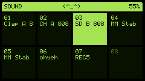
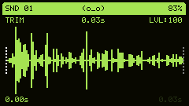
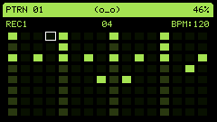
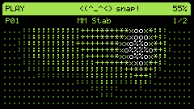

## Features

- **8 projects** with color themes and renameable slots
- **8 sound slots** — record hands-free, push-to-record, or import WAV from SD (16kHz mono, 2s max, trimmable)
- **16-step sequencer** — 16 patterns, 8 tracks, 8-voice polyphony, copy/paste patterns
- **Song mode** — chain up to 16 patterns
- **Live play** — trigger sounds and patterns with playback visualization
- **60-240 BPM** per-project tempo with LED sync (StampS3A)
- **WAV export** — render full song to file on SD
- **`\(^_^)/`** —  beepb0t reacts to your actions and provides feedback
- **Settings** — auto-save, LED mode, confirm delete, boot to project/list

## Controls

| Key | Action |
|-----|--------|
| TAB | Navigate screens |
| S | Save project |
| O | Open project |
| G | Settings |
| M | Cycle LED mode |
| +/- | Volume |
| B+/- | BPM |
| N+/- | Brightness |
| H | Help overlay |
| F | Table flip |
| SPACE | Play/audition |
| CTRL/OK | Select/confirm |
| 1-8 | Trigger sounds |

Navigation uses a tab menu (hold TAB + arrows or tap to cycle).

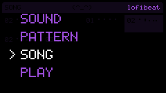

Press **H** on any screen for context-sensitive keyboard shortcuts.

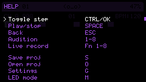

Press **G** for settings.

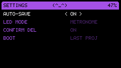

### Sound
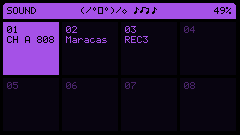
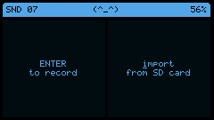
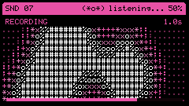
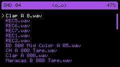
| Key | Action |
|-----|--------|
| CTRL/OK | Edit/Record |
| G0 | Push-to-record into focused slot |
| SPACE | Audition |
| DEL | Clear |
| I | Import WAV |
| R | Rename |
| 1-8 | Audition slot |

### Trim
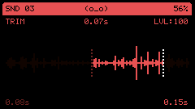
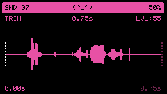
| Key | Action |
|-----|--------|
| L/R | Adjust trim point |
| U/D | Switch between start/end point |
| SPACE | Audition |
| +/- | Volume |
| CTRL/OK | Apply |
| ESC | Cancel |

### Pattern Select
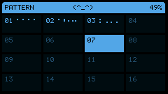
| Key | Action |
|-----|--------|
| CTRL/OK | Edit pattern |
| SPACE | Audition |
| DEL | Clear |
| Fn+C | Copy |
| Fn+V | Paste |

### Pattern Edit

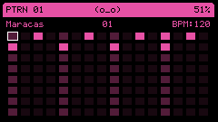
| Key | Action |
|-----|--------|
| CTRL/OK | Toggle step |
| SPACE | Play/stop |
| ESC | Back |
| 1-8 | Audition |
| Fn+1-8 | Live record |

### Song
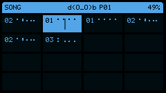
| Key | Action |
|-----|--------|
| CTRL/OK | Edit pattern |
| SPACE | Play song |
| DEL | Clear slot |
| [ ] | Cycle pattern in slot |
| E | Export WAV |

### Play

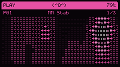
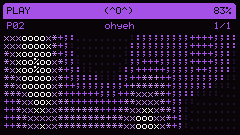
| Key | Action |
|-----|--------|
| SPACE | Play/stop |
| 1-8 | Audition |
| E | Export WAV |

## Known Issues

- Brightness adjustment (N+/-) does not work
- Memory is limited — trim recordings or clear unused slots to free space for new recordings

## Planned Features

- Swing
- Per-slot sound parameters: pitch, bitcrush, low pass filter, high pass filter
- More visualizations

## Architecture

```
src/
├── main.cpp                 # Hardware entry point (M5Stack)
├── config.h                 # Constants (sample rate, grid size, display)
├── core/                    # Platform-independent logic
│   ├── app                  # Main application controller
│   ├── sequencer            # Step sequencer + song playback
│   ├── project              # Data model (sounds, patterns, songs)
│   ├── bloom_field          # Visual bloom/ripple simulation
│   ├── character            # Companion face + message system
│   ├── theme                # Color palette presets
│   ├── canvas               # Drawing abstraction
│   └── sound_slot           # Audio sample container
├── views/                   # Screen implementations
│   ├── sound_view           # Record, trim, rename, import, list
│   ├── pattern_select_view  # Pattern grid + copy/paste/clear
│   ├── pattern_edit_view    # Step grid editor + live record
│   ├── song_view            # Song arrangement with playhead
│   ├── play_view            # Live performance + bloom
│   ├── project_view         # Save/load/delete (2x4 grid)
│   └── settings_view        # Auto-save, LED, warnings
├── platform/                # Hardware HAL (M5Stack Cardputer)
│   ├── audio, display, input, storage, power, memory, led, screenshot
└── platform_desktop/        # Desktop HAL (SDL2)
    ├── main_desktop.cpp     # Desktop entry point
    ├── audio, display, input, storage, power, memory
```

The two main files (`main.cpp` and `platform_desktop/main_desktop.cpp`) share event loops and rendering logic. Platform differences are isolated to the HAL layer.

## Building

### Hardware (M5Stack Cardputer/ADV/Zero)

Requires [PlatformIO](https://platformio.org/).

```sh
pio run -e m5stack-cardputer
pio run -e m5stack-cardputer -t upload
```

### Desktop Simulator

Requires SDL2 and SDL2_image.

```sh
# macOS
brew install sdl2 sdl2_image

# Build (Cardputer / ADV, 240x135)
cmake -B build
cmake --build build

# Build (Zero, 128x128)
cmake -B build -DSCREEN_W=128 -DSCREEN_H=128
cmake --build build

# Run
./build/beepbotdx
```

### Tests

```sh
pio test -e native
```